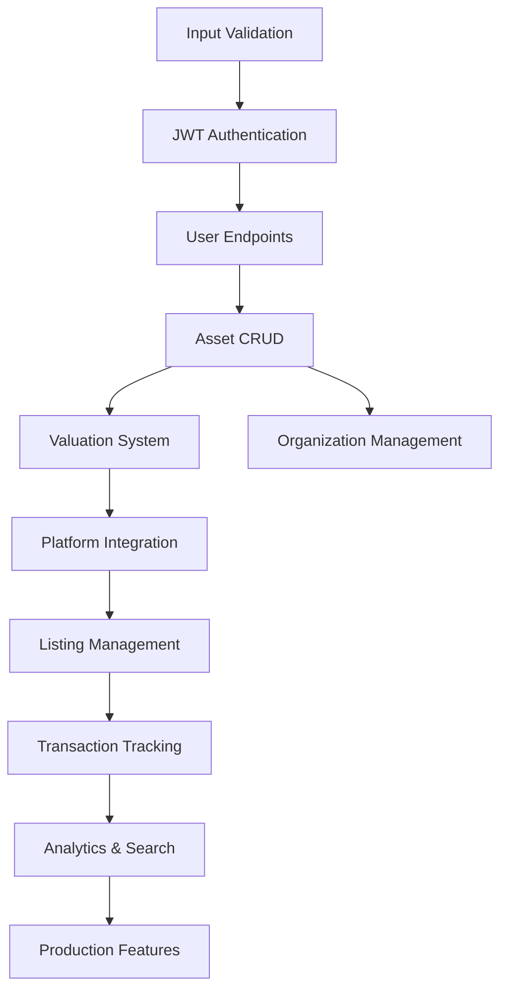

# AssetSync Backend - Complete Development Tasks

This document provides a comprehensive breakdown of all tasks needed to complete the AssetSync backend implementation, organized by priority and development phases.

## 🎯 Current Status

### ✅ Completed Foundation
- Database schema with 19 core tables
- Drizzle ORM configuration and migrations
- Hono web server with CORS and health endpoints
- tRPC setup with type-safe API infrastructure
- Environment configuration with proper validation
- Basic user management routes
- PostgreSQL 17.5 database connection verified
- Development tooling and scripts configured
- **Input Validation Infrastructure with drizzle-zod (Task 1.1)**
  - 57 Zod validation schemas for all 19 database tables
  - Custom validation utilities for business logic
  - Email, password, phone, URL validation functions

### 🚧 In Progress
- Basic tRPC user endpoints (me, updateProfile, stats)
- Project documentation and setup guides

---

## 📋 Phase 1: Security & Authentication Foundation

### Task 1.1: Input Validation Infrastructure
**Priority: HIGH | Estimated: 1-2 days | Status: ✅ COMPLETED**

- [x] Install `drizzle-zod` dependency
- [x] Generate Zod schemas for all 19 database tables using:
  - `createInsertSchema()` for creation endpoints
  - `createUpdateSchema()` for update endpoints  
  - `createSelectSchema()` for response validation
- [x] Create validation utilities module
- [x] Add custom field refinements for business logic:
  - Email format validation
  - Asset amount constraints
  - Phone number formats
  - URL validation for platform connections

**Files created/modified:**
- `src/lib/validation/schemas.ts` - Drizzle-Zod schema exports (57 schemas for 19 tables)
- `src/lib/validation/index.ts` - Custom validation functions and utilities
- `scripts/verify-validation.ts` - Verification script for validation setup
- `scripts/test-schemas.ts` - ESM test for schema imports

**Completion Summary:**
- ✅ drizzle-zod@0.8.2 installed and configured
- ✅ All 19 database tables have complete validation schemas
- ✅ 57 total schemas generated (insert/select/update for each table)
- ✅ Custom validation utilities available (email, password, phone, URL, etc.)
- ✅ Schemas compile without errors and import correctly
- ✅ Verification scripts confirm complete setup

### Task 1.2: JWT Authentication System
**Priority: HIGH | Estimated: 2-3 days**

- [ ] Install JWT dependencies: `@hono/jwt`
- [ ] Implement JWT middleware using Hono's built-in JWT support
- [ ] Create authentication utilities:
  - Token generation (access + refresh tokens)
  - Token verification and validation
  - Token blacklisting for logout
- [ ] Password hashing implementation with bcrypt
- [ ] Session management integration with user schema

**Files to create:**
- `src/lib/auth.ts` - JWT utilities and middleware
- `src/lib/password.ts` - Password hashing utilities
- `src/middleware/auth.ts` - Authentication middleware

### Task 1.3: User Authentication Endpoints
**Priority: HIGH | Estimated: 2 days**

- [ ] User registration endpoint with validation
- [ ] User login endpoint with JWT token response
- [ ] Password reset flow (email + token-based)
- [ ] User profile management endpoints
- [ ] Logout endpoint with token invalidation
- [ ] Email verification system

**tRPC Routes to implement:**
- `auth.register` - User registration
- `auth.login` - User authentication
- `auth.logout` - Session termination
- `auth.refreshToken` - Token renewal
- `auth.resetPassword` - Password reset flow
- `auth.verifyEmail` - Email verification

### Task 1.4: Authorization & Permissions
**Priority: MEDIUM | Estimated: 1-2 days**

- [ ] Role-based access control middleware
- [ ] Organization membership validation
- [ ] Protected route decorators for tRPC
- [ ] Permission checking utilities
- [ ] Rate limiting implementation per user/endpoint

**Files to create:**
- `src/middleware/permissions.ts` - RBAC implementation
- `src/lib/permissions.ts` - Permission checking utilities

---

## 📋 Phase 2: Core Asset Management

### Task 2.1: Asset CRUD Operations
**Priority: HIGH | Estimated: 3-4 days**

- [ ] Complete asset creation with validation
- [ ] Asset update operations (partial updates)
- [ ] Asset deletion (soft delete with status change)
- [ ] Asset listing with filtering and pagination
- [ ] Asset search functionality (by name, category, status)
- [ ] Asset image upload and management

**tRPC Routes to implement:**
- `assets.create` - Create new asset
- `assets.update` - Update asset details
- `assets.delete` - Soft delete asset
- `assets.list` - List user's assets with filters
- `assets.getById` - Get single asset details
- `assets.search` - Search assets by criteria
- `assets.uploadImage` - Handle asset images

### Task 2.2: Asset Categories Management
**Priority: MEDIUM | Estimated: 1-2 days**

- [ ] Category CRUD operations
- [ ] Hierarchical category navigation
- [ ] Category-based asset filtering
- [ ] Popular categories endpoint
- [ ] Category suggestion system

**tRPC Routes to implement:**
- `categories.list` - Get all categories (hierarchical)
- `categories.getByParent` - Get subcategories
- `categories.create` - Create new category (admin)
- `categories.popular` - Get popular categories

### Task 2.3: Asset Valuation System
**Priority: HIGH | Estimated: 4-5 days**

- [ ] Multi-scenario valuation engine (pessimistic/realistic/optimistic)
- [ ] Valuation history tracking
- [ ] Market data integration for automatic valuations
- [ ] Manual valuation override capabilities
- [ ] Valuation comparison tools
- [ ] Depreciation calculation algorithms

**tRPC Routes to implement:**
- `valuations.create` - Create manual valuation
- `valuations.calculate` - Auto-calculate valuation
- `valuations.history` - Get valuation history
- `valuations.compare` - Compare scenarios
- `valuations.update` - Update valuation scenarios

---

## 📋 Phase 3: Platform Integration

### Task 3.1: Platform Management
**Priority: MEDIUM | Estimated: 2-3 days**

- [ ] Platform configuration management
- [ ] OAuth integration for external platforms
- [ ] Platform connection status tracking
- [ ] API credentials management (encrypted)
- [ ] Platform-specific data mapping

**tRPC Routes to implement:**
- `platforms.list` - Get available platforms
- `platforms.connect` - Connect to platform
- `platforms.disconnect` - Remove platform connection
- `platforms.status` - Check connection status

### Task 3.2: Asset Listing Management
**Priority: MEDIUM | Estimated: 3-4 days**

- [ ] Create listings across multiple platforms
- [ ] Listing synchronization between platforms
- [ ] Listing status tracking and updates
- [ ] Automated listing optimization
- [ ] Bulk listing operations
- [ ] Listing performance analytics

**tRPC Routes to implement:**
- `listings.create` - Create new listing
- `listings.publish` - Publish to platforms
- `listings.update` - Update listing details
- `listings.sync` - Sync across platforms
- `listings.analytics` - Get listing performance

### Task 3.3: Market Data Integration
**Priority: LOW | Estimated: 2-3 days**

- [ ] External market data source connections
- [ ] Data collection scheduling system
- [ ] Market trend analysis
- [ ] Price recommendation engine
- [ ] Competitive analysis tools

**tRPC Routes to implement:**
- `market.trends` - Get market trends
- `market.priceRecommendation` - Get suggested prices
- `market.competitors` - Find similar listings

---

## 📋 Phase 4: Business Features

### Task 4.1: Organization Management
**Priority: MEDIUM | Estimated: 2-3 days**

- [ ] Organization CRUD operations
- [ ] Multi-user organization support
- [ ] Organization asset management
- [ ] Role management within organizations
- [ ] Organization settings and preferences

**tRPC Routes to implement:**
- `organizations.create` - Create organization
- `organizations.update` - Update organization
- `organizations.members` - Manage members
- `organizations.assets` - Organization assets
- `organizations.settings` - Organization settings

### Task 4.2: Subscription & Billing
**Priority: LOW | Estimated: 3-4 days**

- [ ] Stripe integration for payments
- [ ] Subscription plan management
- [ ] Usage tracking and limits
- [ ] Billing history and invoices
- [ ] Feature access control based on plan

**tRPC Routes to implement:**
- `billing.plans` - Get available plans
- `billing.subscribe` - Create subscription
- `billing.invoices` - Get billing history
- `billing.usage` - Track feature usage

### Task 4.3: Transaction Tracking
**Priority: MEDIUM | Estimated: 2 days**

- [ ] Sale transaction recording
- [ ] Commission calculation
- [ ] Revenue analytics
- [ ] Financial reporting
- [ ] Tax document generation

**tRPC Routes to implement:**
- `transactions.record` - Record sale
- `transactions.list` - Get transaction history
- `transactions.analytics` - Financial analytics
- `transactions.reports` - Generate reports

---

## 📋 Phase 5: Advanced Features

### Task 5.1: Real-time Features
**Priority: LOW | Estimated: 2-3 days**

- [ ] WebSocket integration with Hono
- [ ] Real-time asset value updates
- [ ] Live notifications for price changes
- [ ] Real-time listing status updates
- [ ] Live chat for asset inquiries

**Implementation:**
- WebSocket middleware for Hono
- Real-time event broadcasting
- Client subscription management

### Task 5.2: Search & Analytics
**Priority: MEDIUM | Estimated: 2-3 days**

- [ ] Advanced asset search with filters
- [ ] Full-text search implementation
- [ ] Analytics dashboard data
- [ ] Performance metrics tracking
- [ ] User behavior analytics

**tRPC Routes to implement:**
- `search.assets` - Advanced asset search
- `analytics.dashboard` - Dashboard metrics
- `analytics.performance` - Performance data

### Task 5.3: Notification System
**Priority: MEDIUM | Estimated: 2 days**

- [ ] Email notification system
- [ ] Push notification integration
- [ ] Notification preferences management
- [ ] Smart selling opportunity alerts
- [ ] Price drop notifications

**tRPC Routes to implement:**
- `notifications.preferences` - Manage settings
- `notifications.list` - Get notifications
- `notifications.markRead` - Mark as read

---

## 📋 Phase 6: Performance & Production

### Task 6.1: Database Optimization
**Priority: MEDIUM | Estimated: 1-2 days**

- [ ] Query optimization review
- [ ] Database indexing optimization
- [ ] Connection pooling configuration
- [ ] Database backup strategy
- [ ] Performance monitoring setup

### Task 6.2: Caching Strategy
**Priority: MEDIUM | Estimated: 1-2 days**

- [ ] Redis integration for caching
- [ ] Cache invalidation strategies
- [ ] Session storage optimization
- [ ] API response caching
- [ ] Database query caching

### Task 6.3: Security Hardening
**Priority: HIGH | Estimated: 1-2 days**

- [ ] Security headers middleware implementation
- [ ] Input sanitization and validation
- [ ] SQL injection prevention audit
- [ ] Rate limiting per endpoint
- [ ] API security testing

### Task 6.4: Monitoring & Logging
**Priority: MEDIUM | Estimated: 1-2 days**

- [ ] Structured logging implementation
- [ ] Error tracking integration (Sentry)
- [ ] Performance monitoring (APM)
- [ ] Health check endpoints
- [ ] Metrics collection

### Task 6.5: Testing Infrastructure
**Priority: HIGH | Estimated: 2-3 days**

- [ ] Unit tests for all business logic
- [ ] Integration tests for tRPC routes
- [ ] Database testing with test containers
- [ ] Authentication flow testing
- [ ] API endpoint testing

### Task 6.6: Documentation & Deployment
**Priority: MEDIUM | Estimated: 1-2 days**

- [ ] API documentation generation
- [ ] Deployment configuration (Docker)
- [ ] Environment setup documentation
- [ ] Production deployment guide
- [ ] Monitoring and alerting setup

---

## 🚀 Development Timeline

### Sprint 1 (Week 1-2): Foundation
- Task 1.1: Input Validation Infrastructure
- Task 1.2: JWT Authentication System
- Task 1.3: User Authentication Endpoints

### Sprint 2 (Week 3-4): Core Features
- Task 1.4: Authorization & Permissions
- Task 2.1: Asset CRUD Operations
- Task 2.2: Asset Categories Management

### Sprint 3 (Week 5-6): Valuation & Integration
- Task 2.3: Asset Valuation System
- Task 3.1: Platform Management
- Task 6.3: Security Hardening

### Sprint 4 (Week 7-8): Business Features
- Task 3.2: Asset Listing Management
- Task 4.1: Organization Management
- Task 4.3: Transaction Tracking

### Sprint 5 (Week 9-10): Advanced & Production
- Task 5.2: Search & Analytics
- Task 5.3: Notification System
- Task 6.1-6.2: Performance Optimization

### Sprint 6 (Week 11-12): Polish & Deploy
- Task 6.4: Monitoring & Logging
- Task 6.5: Testing Infrastructure
- Task 6.6: Documentation & Deployment

---

## 📊 Task Dependencies

## 🎯 Next Immediate Actions

1. **Start with Task 1.1** - Install drizzle-zod and setup validation infrastructure
2. **Implement Task 1.2** - JWT authentication system
3. **Complete Task 1.3** - User authentication endpoints
4. **Begin Task 2.1** - Asset CRUD operations

This roadmap will transform the AssetSync backend from a foundation into a complete, production-ready asset management platform.
